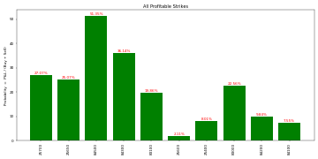
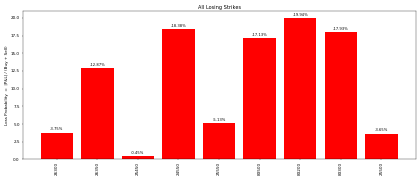
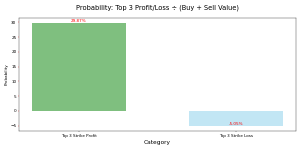

# Trading-Performance-Analysis

# 📊 Trading Performance Analysis (BSE/NSE)

This project performs in-depth analysis of historical trading data (equity & options), identifying profitable and loss-making strike prices, summarizing performance, and visualizing key metrics.

---

## 🔍 Features

- ✅ Sorts trades by realized profit/loss
- 📈 Aggregates performance by symbol
- 📊 Generates visualizations for:
  - Profitable strikes
  - Loss-making strikes
  - Profit/loss threshold probabilities
- 📁 Outputs: Excel reports, PNG charts, and summaries

---

## 📈 Sample Visuals

### 🔼 Profitable Strikes

### 🔽 Losing Strikes

### 🎯 Top 3 Profit vs Loss Probability

## 🧪 How to Run

### 1. Clone the Repository
bash
git clone https://github.com/BhavneshMehra/Trading-Performance-Analysis.git
cd Trading-Performance-Analysis

### 2. Install Dependencies
pip install -r requirements.txt

### 3. Run the Notebook
jupyter notebook notebooks/analysis300625.ipynb

📚 Technologies Used
Python 3.13
pandas, numpy, matplotlib

Jupyter Notebook

Excel (XLSX output)

📁 Dataset
File: ![30th jun nse bse.csv]
Columns include:

Symbol, Buy/Sell Qty & Price

Realized Profit

Net Position

User ID, Exchange Info

👨‍💻 Author
Bhavnesh Mehra

